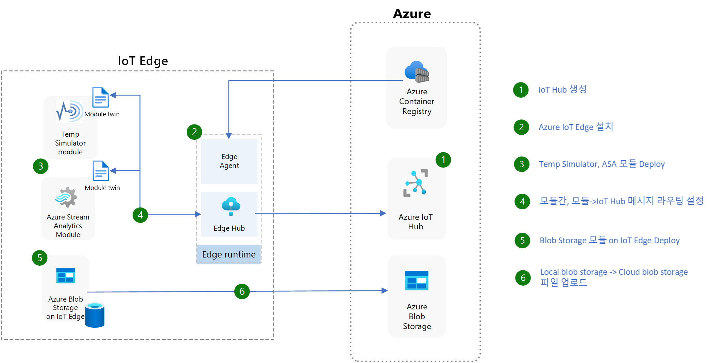

# Azure IoT Edge Hands-on Lab

## Hands-on Lab 개요

본 실습은 Azure IoT Edge의 기본 개념과 구성 요소를 이해하고, Azure IoT Edge를 사용하여 IoT Edge 디바이스를 프로비저닝하고, Azure IoT Edge 모듈을 배포하고, Azure IoT Edge 디바이스에서 모듈을 모니터링하는 방법을 학습합니다.

## Azure IoT Edge 개요

Azure IoT Edge는 Azure IoT Hub와 연결된 IoT 디바이스에서 클라우드 기능을 디바이스에 가까운 지역에서 실행할 수 있도록 하는 서비스입니다. Azure IoT Edge는 클라우드에서 디바이스로 머신 러닝, 인공 지능, Azure 서비스 또는 사용자 지정 로직을 배포할 수 있습니다. 

Azure IoT Edge는 디바이스에서 실행되는 코드를 클라우드에서 관리할 수 있도록 합니다. 

## Hands-on Lab 소개

본 실습에서는 Azure IoT Hub를 생성하고 Azure IoT Edge 디바이스를 프로비저닝하고, Azure IoT Edge 모듈을 배포하고 모듈간의 메세지 라우팅에 대해서 실습합니다. Azure Blob Storage 모듈을 사용하여 IoT Edge 디바이스에서 생성된 데이터를 Blob Storage에 저장하는 방법을 학습합니다. 

## 사용 리소스 및 환경
  * Azure IoT Hub
  * Azure IoT Edge
  * Azure Container Registry
  * Azure Storage Account (Blob Storage)
  * Azure Stream Analytics

## High Level Architecture
  
  

## 사전 요구 사항 (필요 도구)

* Azure 구독
* [Azure IoT Explorer 다운로드 및 설치](https://github.com/Azure/azure-iot-explorer/releases)
* [Azure Storage Explorer 다운로드 및 설치](https://azure.microsoft.com/ko-kr/features/storage-explorer/)

## 실습 순서

* [Step 1. Azure IoT Hub 생성](https://learn.microsoft.com/ko-kr/azure/iot-hub/iot-hub-create-through-portal)
* [Step 2. Azure IoT Edge 디바이스 만들기](https://github.com/jeongaelee/Azure-IoT-Edge-Stoage/blob/main/step02.md)
* [Step 3. Azure Stream Analytics 모듈 디플로이 및 Message Routing 이해](https://github.com/jeongaelee/Azure-IoT-Edge-Stoage/blob/main/step03.md)
* [Step 4. IoT Edge 디바이스와 Azure Blob Storage 연동](https://github.com/jeongaelee/Azure-IoT-Edge-Stoage/blob/main/step04.md)

## Next Step

* [Custom IoT Edge 모듈 개발하기](https://learn.microsoft.com/en-us/azure/iot-edge/tutorial-develop-for-linux?view=iotedge-1.4&tabs=csharp&pivots=iotedge-dev-cli)
* [Blob Storage에 파일 업로드](https://sandervandevelde.wordpress.com/2019/08/28/azure-iot-edge-blob-module-posts-dosed-in-blocks-blockblobs-in-storage/)
