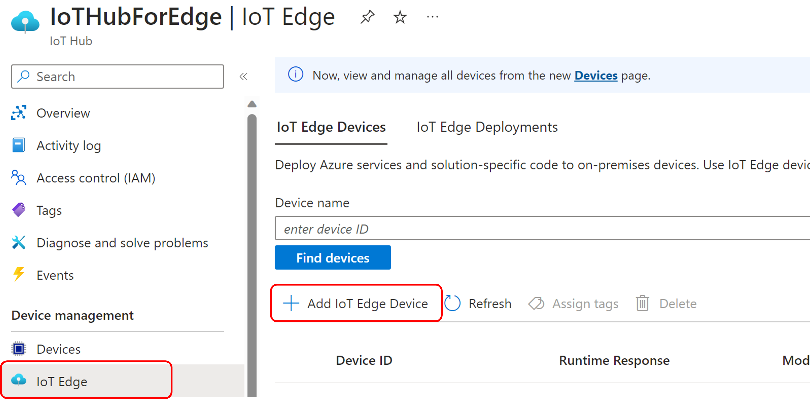
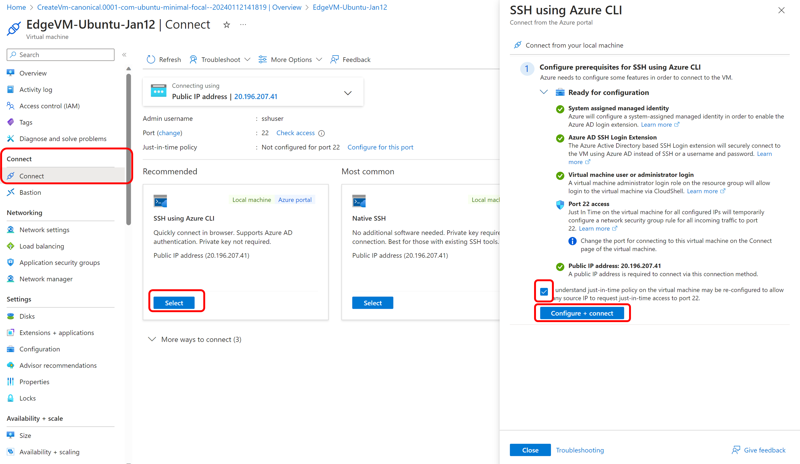
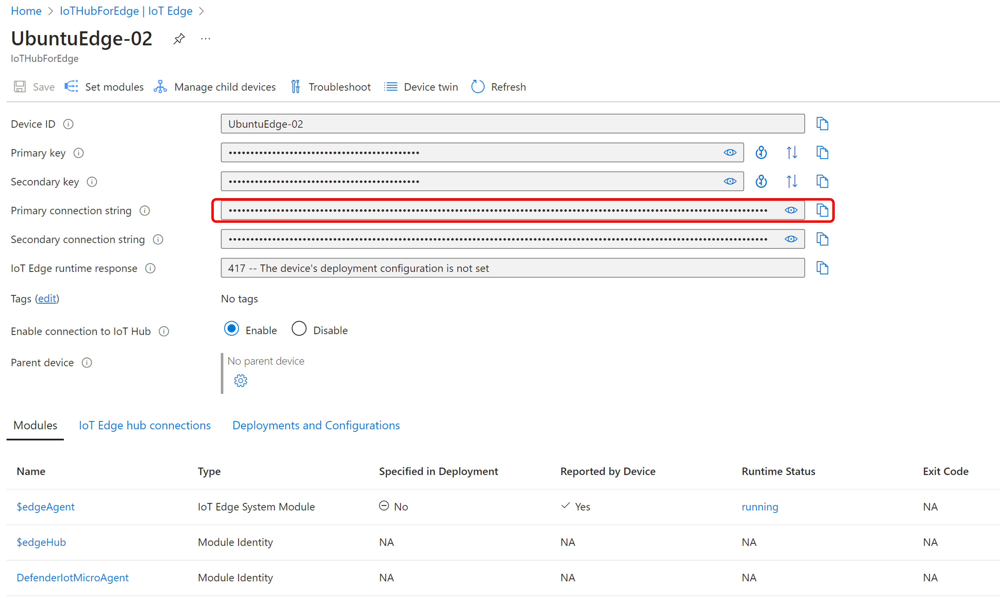
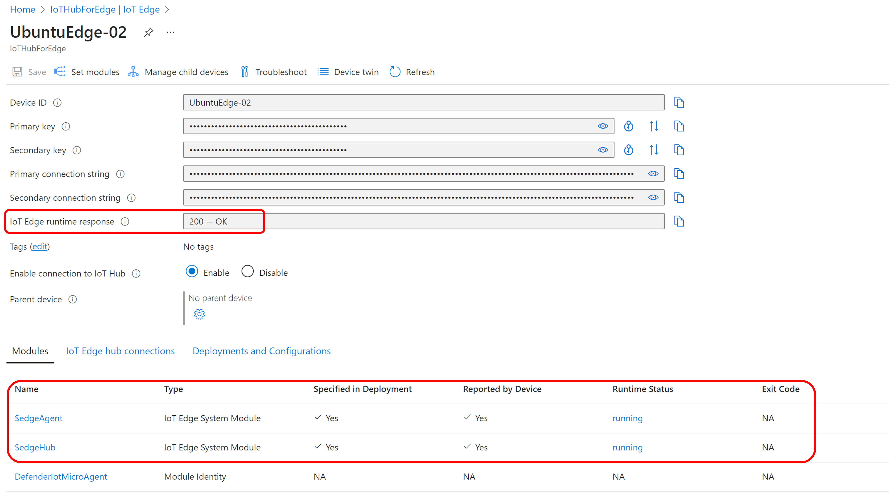
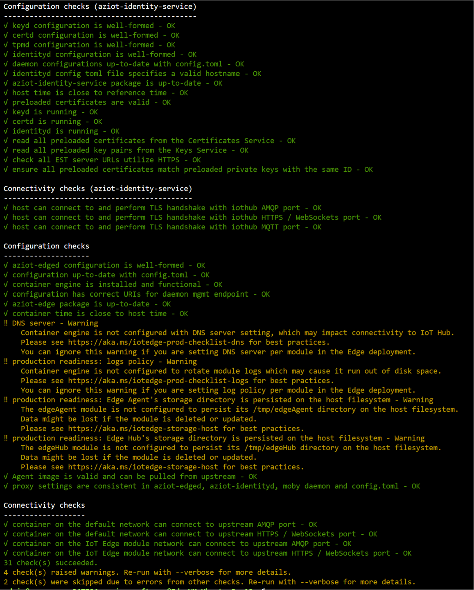

# Azure IoT Edge Hands-on Lab

## Step02. Ubuntu 20.04 Linux에서 IoT Edge 디바이스 만들기 및 프로비전

본 단계는 [대칭 키를 사용하여 Linux에서 IoT Edge 디바이스 만들기 및 프로비전](https://learn.microsoft.com/ko-kr/azure/iot-edge/how-to-provision-single-device-linux-symmetric?view=iotedge-1.4&tabs=azure-portal%2Cubuntu#register-your-device) 문서를 참고하여 진행합니다.

### Edge 디바이스 등록

1. Azure Portal에서 Azure IoT Hub 리소스로 이동합니다.

2. Device Management 아래의 IoT Edge 메뉴를 선택합니다.

3. Add IoT Edge Device 버튼을 클릭합니다.

    

4. 디바이스 만들기 페이지에서 다음 정보를 제공합니다.

    * 예를 들어 설명이 포함된 디바이스 ID를 만듭니다(모두 my-edge-device-1 소문자). 나중에 사용할 수 있으므로 이 디바이스 ID를 복사합니다.
    * IoT Edge 디바이스 확인란을 선택합니다.
    * 인증 유형으로 대칭 키를 선택합니다.
    * 기본 설정을 사용하여 인증 키를 자동으로 생성하여 새 디바이스를 허브에 연결합니다.
    * 저장을 선택합니다.
  
    * IoT Hub에 나열된 새 디바이스가 표시됩니다.

5. 등록된 디바이스 보기 및 프로비전 정보 검색

    * IoT Hub에 연결하는 에지 사용 디바이스는 IoT Hub의 디바이스 페이지에 나열됩니다. 디바이스가 여러 개 있는 경우 IoT Edge 디바이스 유형을 선택하여 목록을 필터링한 다음 적용을 선택할 수 있습니다.

    * 디바이스를 설정할 준비가 되면 물리적 디바이스를 IoT Hub의 ID와 연결하는 연결 문자열 필요합니다. 대칭 키를 사용하여 인증하는 디바이스에는 포털에서 복사할 수 있는 연결 문자열 있습니다. 포털에서 연결 문자열 찾으려면 다음을 수행합니다.
        * 디바이스 페이지의 목록에서 IoT Edge 디바이스 ID를 선택합니다.
        * 기본 Connection String 또는 보조 Connection String의 값을 복사합니다. 두 키 중 하나가 작동합니다.

### IoT Edge 디바이스 역할을 할 Ubuntu VM 생성 후 접속

1. Azure Portal에서 [Ubuntu VM을 생성](https://learn.microsoft.com/ko-kr/azure/virtual-machines/linux/quick-create-portal?tabs=ubuntu) 합니다. Ubuntu VM은 20.04로 설치하시기 바랍니다.

2. 생성된 Ubuntu VM에 SSH로 접속합니다.

    

### IoT Edge Runtime 설치 (Ubuntu 20.04 기준)

1. 아래의 Bash 스크립트로 IoT Edge 패키지를 다운받아 설치합니다.

``` 
wget https://packages.microsoft.com/config/ubuntu/20.04/packages-microsoft-prod.deb -O packages-microsoft-prod.deb
sudo dpkg -i packages-microsoft-prod.deb
rm packages-microsoft-prod.deb
```

2. 컨테이너 엔진 설치
```
sudo apt-get update; \
  sudo apt-get install moby-engine
```

3. IoT Edge 런타임 설치
```
sudo apt-get update; \
   sudo apt-get install aziot-edge defender-iot-micro-agent-edge
```

4. 클라우드 ID를 사용한 디바이스 프로비전

* 아래의 PASTE_DEVICE_CONNECTION_STRING_HERE를 IoT Hub -> IoT Edge -> 디바이스 ID 선택 -> 연결 문자열 복사 후 붙여넣기 합니다.

    

```
sudo iotedge config mp --connection-string 'PASTE_DEVICE_CONNECTION_STRING_HERE'
```

## 모듈 배포

* IoT Edge 모듈 배포를 위하여 IoT Hub로 이동한 다음, 다음을 수행합니다.

1. IoT Hub 메뉴에서 디바이스를 선택합니다.

2. 디바이스를 선택하여 해당 페이지를 엽니다.

3. 모듈 설정 탭을 선택합니다.

4. IoT Edge 기본 모듈(edgeAgent 및 edgeHub)을 배포하려고 하므로 이 창에 모듈을 추가할 필요가 없으므로 아래쪽에서 검토 + 만들기를 선택합니다.

5. 모듈의 JSON 확인이 표시됩니다. 만들기를 선택하여 모듈을 배포합니다.

6. Azure Portal의 IoT Hub에서 아래와 같이 IoT Edge runtime response는 "200 -- OK"로, $edgeAgent와 $edgeHub의 상태는 "running"으로 표시되는 것을 확인합니다.

    

## IoT Edge 구성 성공 확인

1. Ubuntu VM에서 IoT Edge 시스템 서비스가 실행되고 있는지 확인합니다.
```
sudo iotedge system status
```

2. 이 check 도구를 사용하여 디바이스의 구성 및 연결 상태를 확인합니다.
```
sudo iotedge check
```

3. 아래와 같이 연결 상태를 확인합니다.

    

## 실습 순서

* [Step 1. Azure IoT Hub 생성](https://learn.microsoft.com/ko-kr/azure/iot-hub/iot-hub-create-through-portal)
* [Step 2. Azure IoT Edge 디바이스 만들기](https://github.com/jeongaelee/Azure-IoT-Edge-Stoage/blob/main/step02.md)
* [Step 3. Azure Stream Analytics 모듈 디플로이 및 Message Routing 이해](https://github.com/jeongaelee/Azure-IoT-Edge-Stoage/blob/main/step03.md)
* [Step 4. IoT Edge 디바이스와 Azure Blob Storage 연동](https://github.com/jeongaelee/Azure-IoT-Edge-Stoage/blob/main/step04.md)
