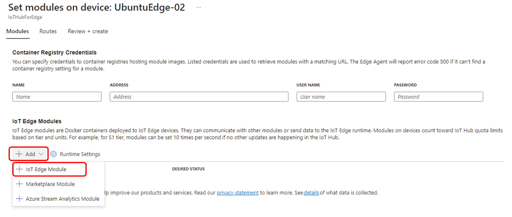
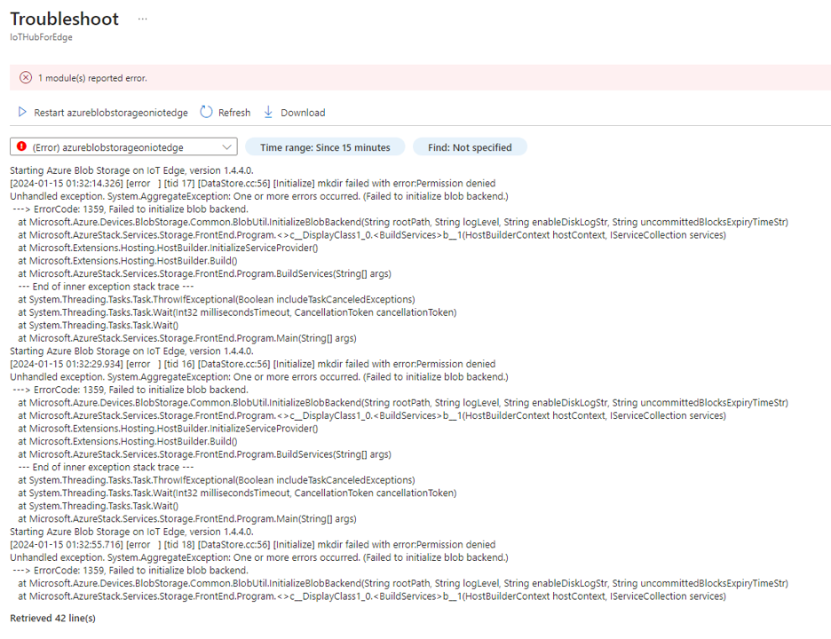
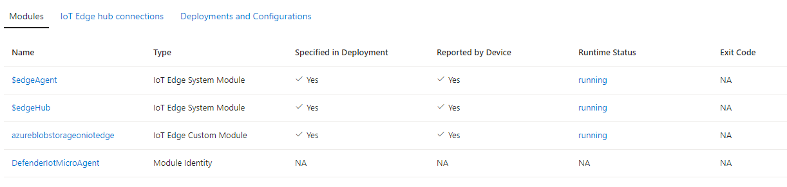
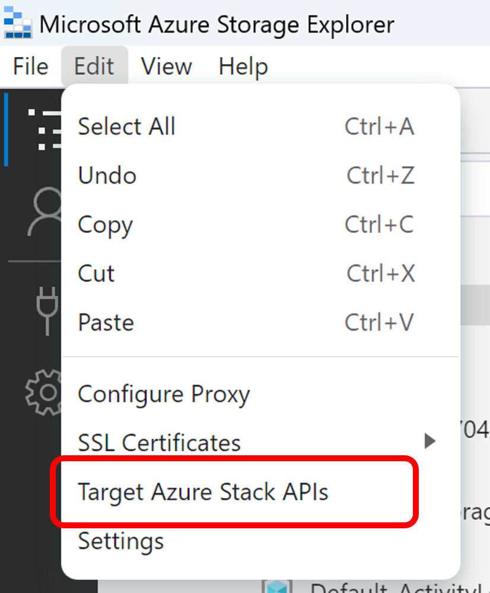
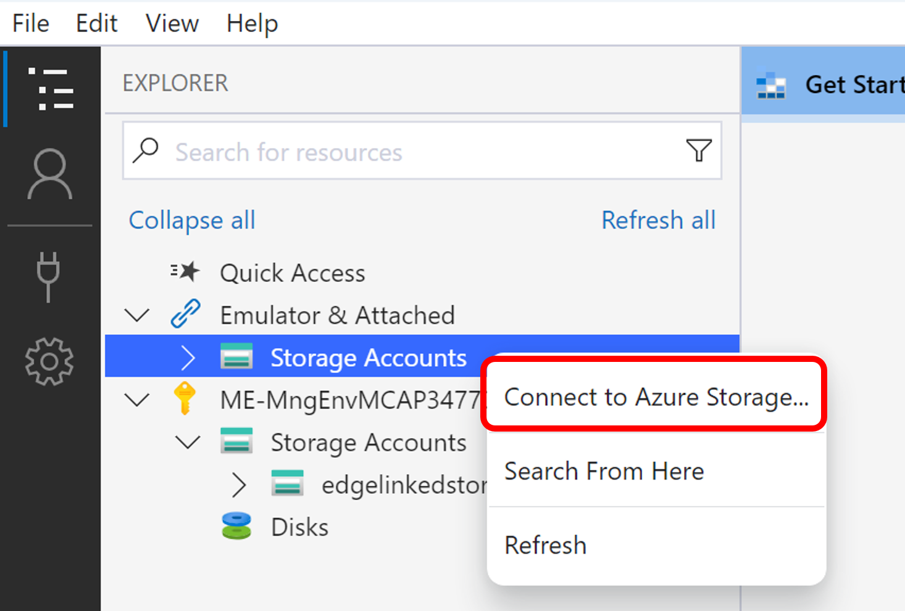
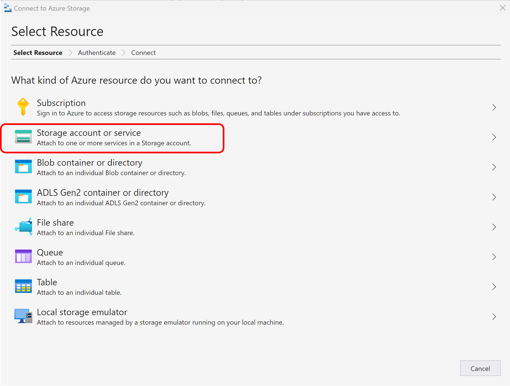
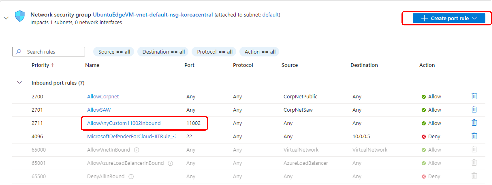

# Azure IoT Edge Hands-on Lab

## Step04. Azure Blob Storage on IoT Edge

본 단계는 [IoT Edge에서 Azure Blob Storage를 사용하여 에지에 데이터 저장](https://learn.microsoft.com/ko-kr/azure/iot-edge/how-to-store-data-blob?view=iotedge-1.4)과 [IoT Edge 모듈의 Azure Blob Storage를 디바이스에 배포](https://learn.microsoft.com/ko-kr/azure/iot-edge/how-to-deploy-blob?view=iotedge-1.4) 문서를 참고하여 진행합니다.

### Blob Storage 모듈 배포

#### 디바이스 선택

1. Azure Portal에서 Azure IoT Hub 리소스로 이동합니다.

2. 장치 관리 메뉴 아래에서 디바이스를 선택합니다.

3. 목록에서 대상 IoT Edge 디바이스를 선택합니다.

4. 모듈 설정을 선택합니다.

#### 배포 매니페스트 구성

배포 매니페스트는 배포할 모듈, 모듈 간의 데이터 흐름 및 Module Twins의 desired 속성을 설정하는 JSON 문서입니다.

1. 모듈 설정 페이지에서 "+Add" 버튼을 클릭하고, "IoT Edge 모듈"을 선택합니다.

    

2. IoT Edge 모듈 이름과 이미지 URI를 아래와 같이 입력합니다.

    * IoT Edge 모듈 이름: azureblobstorageoniotedge
    * 이미지 URI: mcr.microsoft.com/azure-blob-storage:latest

    

3. Container Create Options 탭을 클릭하여 아래의 JSON을 복사하여 입력란에 붙여넣습니다.

    * LOCAL_STORAGE_ACCOUNT_NAME을 3~24의 소문자와 숫자 조합으로 원하시는 값으로 입력하고, LOCAL_STORAGE_ACCOUNT_KEY는 [GeneratePlus](https://generate.plus/en/base64)와 같은 도구를 사용하여 64바이트 base64 키로 바꿉니다.
    * Linux Container의 바인딩 탑재를 사용하는 경우 "/srv/containerdata:/blobroot"를 입력합니다.

    ```
    {
        "Env": [
            "LOCAL_STORAGE_ACCOUNT_NAME=ubuntuedgelocalstorage",
            "LOCAL_STORAGE_ACCOUNT_KEY=38ECUcYTiB3EOUDOV4tZQWihFoJ+ZaxWyhNKYUewbOV1Tq0Ece57ba49/tldry3niwQadlNU77SFIDsRyS5DHA=="
        ],
        "HostConfig": {
            "Binds": [
                "/srv/containerdata:/blobroot"
            ],
            "PortBindings": {
                "11002/tcp": [
                    {
                        "HostPort": "11002"
                    }
                ]
            }
        }
    }
    ```

4. Module Twin Settings 탭을 클릭하여 아래의 desired 값을 입력합니다. [deviceAutoDeleteProperties과 deviceToCloudUploadProperties](https://learn.microsoft.com/ko-kr/azure/iot-edge/how-to-store-data-blob?view=iotedge-1.4#devicetocloudupload-and-deviceautodelete-properties)의 속성 값을 아래와 같이 설정합니다. "cloudStorageConnectionString"에는 Azure Cloud의 Blob Storage의 연결 문자열을 입력합니다. "storageContainersForUpload"에는 로컬 스토리지의 Container 이름과 "target", 즉 Cloud의 Blob Storage의 Container 이름을 입력합니다.

    ```
    {
        "deviceAutoDeleteProperties": {
            "deleteOn": false,
            "deleteAfterMinutes": 20,
            "retainWhileUploading": true
        },
        "deviceToCloudUploadProperties": {
            "uploadOn": true,
            "uploadOrder": "OldestFirst",
            "cloudStorageConnectionString": "DefaultEndpointsProtocol=https;AccountName=edgelinkedstorageaccount;AccountKey=/qzE3ivzm6Izt2z6EXB1XhhGAametThZKYIQqAtXANorW4DB2T28WOy0exO2NNXTGesF6Ij0tBPg+AStawyS5w==;EndpointSuffix=core.windows.net",
            "storageContainersForUpload": {
                "cont1": {
                    "target": "edgeblobcontainer"
                }
            },
            "deleteAfterUpload": false
        }
    }
    ```

5. "Add" 버튼을 클릭하여 모듈을 추가합니다.

6. "Review + Create"를 선택하여 설정을 검토하고, "Create"를 선택하여 배포를 시작합니다.

* 컨테이너 사용자에 대한 디렉터리 액세스 권한이 부여되지 않으면 아래와 같이 "Permission denied" 에러가 발생합니다. 다음 단계의 Linux에서 컨테이너 사용자에 대한 디렉터리 액세스 권한 부여를 참고하여 디렉터리 액세스 권한을 부여합니다.

    

### Linux에서 컨테이너 사용자에 대한 디렉터리 액세스 권한 부여

Linux 컨테이너에서 스토리지 바인딩 탑재를 사용하는 경우에는 디렉터리 액세스 권한 부여 과정이 필요합니다.

1. 호스트에서 다음 명령을 실행하여 컨테이너 사용자에 대한 디렉터리 액세스 권한을 부여합니다.

```
sudo chown -R 11000:11000 /srv/containerdata
sudo chmod -R 700 /srv/containerdata
```

2. 권한 부여 후에는 아래와 같이 Blob Storage 모듈의 Rumtime Status가 "running" 상태가 됩니다.

    

### Azure Storage Explorer를 사용하여 로컬 스토리지에 연결

이번 단계에서는 [Azure Storage Explorer](https://azure.microsoft.com/features/storage-explorer/)를 사용하여 로컬 스토리지에 연결하고, 파일을 업로드하여 클라우드의 Blob Storage에 저장되는 것을 확인합니다.

1. [Azure Storage Explorer](https://azure.microsoft.com/features/storage-explorer/)를 설치합니다.

2. 최신 버전의 Azure Storage Explorer는 Blob Storage 모듈에서 지원하지 않는 최신 API를 사용하기 때문에 설정을 변경하여야 합니다. Azure Storage Explorer를 실행하고 "Edit" 메뉴의 "Target Azure Stack API"을 선택하고 restart 합니다.

    

3. 아래 단계와 같이 "Connect to Azure Storage" 메뉴를 선택하고, Connection String을 이용하여 Local Blob Storage에 연결합니다. Connection String은 아래와 같은 형식으로 구성됩니다. "host device name"에 Ubuntu VM의 IP값 (혹은 호스트값)을 입력합니다. "your local account name"에는 LOCAL_STORAGE_ACCOUNT_NAME의 값을 입력합니다. "your local account key"에는 LOCAL_STORAGE_ACCOUNT_KEY의 값을 입력합니다.

    

    

    * Connection String 형식

    ```
    DefaultEndpointsProtocol=http;BlobEndpoint=http://<host device name>:11002/<your local account name>;AccountName=<your local account name>;AccountKey=<your local account key>;
    ```

    * 예시
    ```
    LOCAL_STORAGE_ACCOUNT_NAME=ubuntuedgelocalstorage
    LOCAL_STORAGE_ACCOUNT_KEY=38ECUcYTiB3EOUDOV4tZQWihFoJ+ZaxWyhNKYUewbOV1Tq0Ece57ba49/tldry3niwQadlNU77SFIDsRyS5DHA==
    ```

4. Ubuntu VM에서 Azure Storage Explorer를 통하여 파일을 업로드 할 수 있도록 Inbound port rules에 11002 포트를 Allow 하는 룰을 추가합니다

    

5. Azure Storage Explorer에 연결된 로컬 스토리지에 Module Twin Settings 단계에서 지정한 이름의 Container(예: cont1)를 하나 추가한 후, 파일을 업로드하여 클라우드의 target Blob Storage의 Container(예: edgeblobcontainer) 저장되는 것을 확인합니다.

6. 파일이 정상적으로 업로드 되는 것을 확인하면, [deviceAutoDeleteProperties과 deviceToCloudUploadProperties](https://learn.microsoft.com/ko-kr/azure/iot-edge/how-to-store-data-blob?view=iotedge-1.4#devicetocloudupload-and-deviceautodelete-properties)의 속성 값을 참고하여, "deleteOn"등의 값을 변경하여 원하는 동작을 수행할 수 있습니다.

## 실습 순서

* [Step 1. Azure IoT Hub 생성](https://learn.microsoft.com/ko-kr/azure/iot-hub/iot-hub-create-through-portal)
* [Step 2. Azure IoT Edge 디바이스 만들기](https://github.com/jeongaelee/Azure-IoT-Edge-Stoage/blob/main/step02.md)
* [Step 3. Azure Stream Analytics 모듈 디플로이 및 Message Routing 이해](https://github.com/jeongaelee/Azure-IoT-Edge-Stoage/blob/main/step03.md)
* [Step 4. IoT Edge 디바이스와 Azure Blob Storage 연동](https://github.com/jeongaelee/Azure-IoT-Edge-Stoage/blob/main/step04.md)